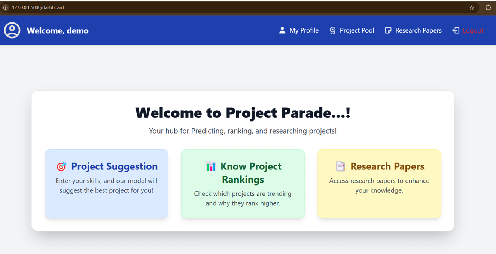
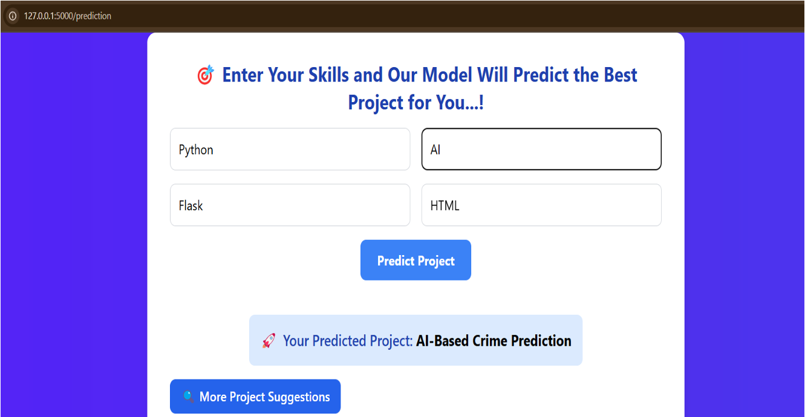
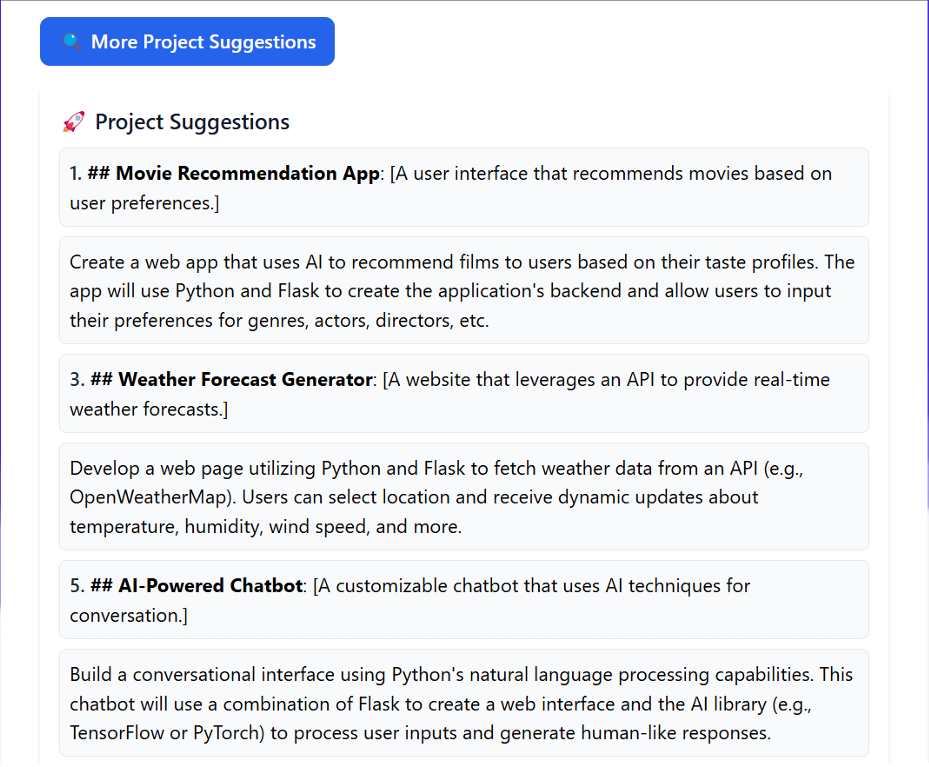
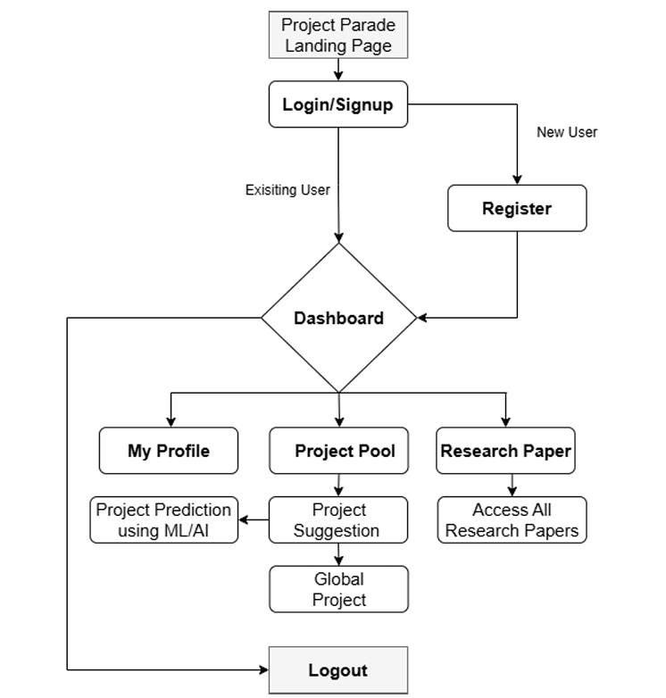

---

# 🎯 Project Parade

**Project Parade** is a web-based student profiling system designed to help students find the most suitable mini-projects based on their skills, interests, and academic background. It leverages a **Decision Tree machine learning model** to recommend domain-specific projects such as Web Development, Artificial Intelligence, and Embedded Systems.

## 🚀 Key Features

* 🔐 User authentication system (login/register)
* 📊 Profile mapping using machine learning (Decision Tree Classifier)
* 📁 Project suggestion based on interests and marks
* 🛠️ Admin dashboard to manage and assign projects
* 🧠 Model trained on domain-interest data, saved using `.pkl`
* 🌐 Tech stack: Python, Flask, MySQL, HTML/CSS

## 🧠 How It Works

1. Students register and fill in their profile (marks, interests, etc.)
2. The trained ML model predicts the best-fit domain.
3. Based on the domain, relevant mini-projects are recommended.
4. Admins can view and assign projects to students accordingly.

## 📦 Tech Stack

* Python, Flask (Backend)
* MySQL (Database)
* HTML, CSS (Frontend)
* Scikit-learn (Model training)
* Pickle (Model serialization)

## 🧪 Model

* Algorithm: Decision Tree Classifier
* Features used: Student marks, interest areas
* Output: Recommended project domain

  ## 🖼️ Screenshots
  
### 🧾 User Dashboard

### 🔐  Project Prediction Result

### 🎯 Project /suggestions

### 🛠️ Flow Chart For Website

---

